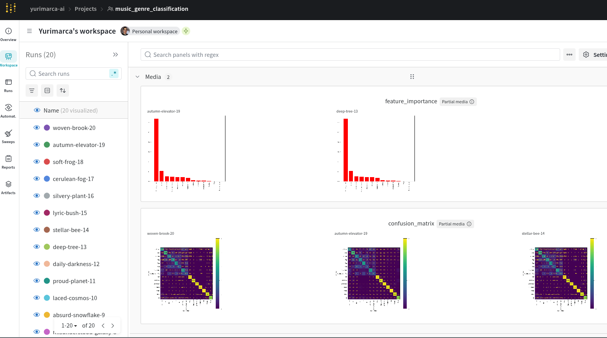
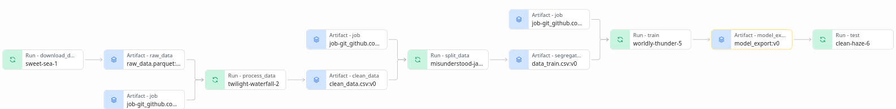

# Music Genre Classification


This repository contains an end-to-end machine learning pipeline for music genre classification using a dataset from Spotify. The project demonstrates MLOps best practices, leveraging MLflow and Weights & Biases (W&B) for experiment tracking, reproducibility, and model evaluation.

## Project Overview
- **Objective:** Classify songs into different genres based on audio features.
- **Dataset:** Extracted from Spotify API, containing numerical and categorical song features.
- **Model:** Random Forest classifier for genre classification.
- **Tools:** MLflow, W&B, Hydra.

## Repository Structure
```
├── check_data.py      # Validates and inspects dataset
├── download.py        # Downloads dataset
├── evaluate.py        # Evaluates model performance
├── preprocess.py      # Preprocesses raw data
├── segregate.py       # Splits data into train/validation/test sets
├── train_rf.py        # Trains a Random Forest model
├── main.py            # Entry point to run the full ML pipeline
├── MLproject          # Defines MLflow project structure
├── requirements.txt   # Python dependencies
├── config.yaml        # Configuration settings
├── mlruns/            # MLflow experiment data
├── outputs/           # Model artifacts and logs
├── figures/           # Visualizations
└── README.md          # Project documentation
```

## Installation
To set up the environment, use a virtual environment:
```bash
python -m venv venv
source venv/bin/activate  # On Windows use: venv\Scripts\activate
pip install -r requirements.txt
```

## Usage
To run the complete pipeline, execute:
```bash
mlflow run .
```

Alternatively, you can run  MLflow with Git Repository Release [1.0](https://github.com/yurimarca/music_genre_classification/releases/tag/1.0):
```bash
mlflow run https://github.com/yurimarca/music_genre_classification.git -v 1.0
```
This will download and execute the latest released version of the pipeline.


## Experiment Tracking
- **Weights & Biases (W&B):** Logs experiment details for better visualization.

### W&B workspace showing experiment runs



### Visualization of the artifact lineage.




## Key Features
- Fully automated ML pipeline
- MLflow for experiment pipeline orchestration & W&B for experiment tracking
- Config-driven using Hydra
- Data validation and preprocessing

## License
This project is licensed under the MIT License - see the [LICENSE](LICENSE) file for details.

## Contact
For questions or collaboration, feel free to open an issue or reach out.
